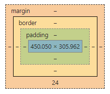

# HTML, CSS

## Prerequisite

HTML 코드를 작성하기 위한 text editor를 설치해 주세요.
에디터의 종류는 본인 취향껏 선택하시면 됩니다.

* [Atom text editor](https://atom.io): 세미나장은 본 에디터를 사용해서 실습 강의를 진행할 것입니다.
* [Sublime Text 3](https://www.sublimetext.com/3): 라이선스 구매는 유료지만, 체험판을 무기한동안 이용할 수 있습니다. 종종 라이선스를 구매하라는 대화 상자가 뜹니다.
* [Visual Studio Code](https://code.visualstudio.com/)
* [Notepad++](https://notepad-plus-plus.org/download/): 윈도우 전용이고 가벼운 text editor 입니다. 코딩할 때 쓴다기 보다는 인코딩을 변환하는 등의 가벼운 작업할 때 유용합니다.

또 강의 후반부에는 [Google Chrome](https://www.google.com/chrome/) 웹브라우저를 이용해서 실제 웹페이지의 HTML elements를 분석하는 시간을 가질 것입니다.

## HTML(Hyper Text Markup Language)

> ### What is HTML?
> HTML is the standard markup language for creating Web pages.
> *[HTML Introduction - w3schools.com](https://www.w3schools.com/html/html_intro.asp)*

**HTML은 마크업 언어입니다.** 마크업 언어는 **문서의 구조를 기술하기 위한 언어로** 프로그램의 동작을 기술하기 위한 **프로그래밍 언어와는 구별됩니다**.


마크업 언어의 또 다른 예로는, 지금 이 세미나 자료가 작성되는 Markdown 언어가 있습니다. HTML보다는 자유도가 떨어지지만, 마크다운으로도 문서의 제목-소제목-이미지-외부 링크 구조를 설계할 수 있습니다.

### HTML elements

```html
<!DOCTYPE html>
<html lang="en" dir="ltr">
  <head>
    <meta charset="utf-8">
    <title>WaffleStudio Seminar</title>
  </head>
  <body>
    <p>The first paragraph.</p>
  </body>
</html>
```

HTML은 element로 구성되어 있으며, 각각의 element는 tag로 표현됩니다.
tag는 `<tagname>`으로 시작해서 `</tagname>`으로 끝나며, 경우에 따라 닫는 tag가 없을 수도 있습니다. 닫는 tag가 있을 경우, 그 사이 내용(content)에는 텍스트 또는 또다른 HTML element가 들어갈 수 있습니다.


[이 링크](doc1.html)에서 HTML 소스 코드가 어떤 웹 페이지를 만들었는 지 확인하실 수 있습니다.

``<html lang="en" dir="ltr">``에서 `lang="en"`이나 `dir="ltr"`같은 것을 속성(attribute)라고 부릅니다. HTML elements의 tag는 1개 이상의 속성을 가질 수 있습니다. `lang="en"`은 HTML 문서가 영어로 되어있음을, `dir="ltr"`은 HTML 문서가 left-to-right 방향으로 읽는 자연어로 쓰여있음을 함의합니다.

### 주요 HTML tags

#### 뼈대를 구성

* `<html>`
* `<head>`: 문서의 본문 외적인 속성
  - `<meta>`: 메타 정보 ("문서 그 자체"의 정보)를 담음
    - 예) `charset="utf8"`은 문서의 인코딩을 지정함
  - `<title>`: 웹페이지 제목을 결정
  - `<link>`: 다른 파일(주로 CSS)의 정보를 불러옴
* `<body>`: 본문 (실제로 보여지는 content)
  - `<div>`: division, 일종의 box
  - `<p>`: paragraph

#### 꾸밈을 위한 태그

* `<h1>` ~ `<h6>`: headings
* `<a href="url">`: 외부 링크
  - *href* 속성은 상대경로도, 절대경로도 가능하다.
* ``: 이미지
  - 추가로 *width*, *height*, *alt*(alternative text, 이미지가 표시 안될 때 대체할 만한 설명문) 등을 속성으로 지정할 수 있다.

##### 텍스트를 꾸미기 위한 태그

* `<strong>` 또는 `<b>`: <strong>굵</strong><b>게</b>
* `<i>` 또는 `<em>`: <i>기울</i><em>임</em>
* `<mark>`: <mark>highlighted</mark> text
* `<del>`: <del>removed</del> text
* 그 외 `<ins>`, `<sub>`, `<sup>` 등

#### 주석(comment)

`<!-- 문서 요소로 해석되지는 않고, 코드 가독성을 위한 태그 -->`
* ol, ul, dl

#### Table

```html

<table>
  <thead>
    <tr>
      <th>날짜</th>
      <th>주제</th>
      <th style="text-align: left">과제</th>
    </tr>
  </thead>
  <tbody>
    <tr>
      <td>9월 28일</td>
      <td><a href="1/">Git, GitHub</a></td>
      <td style="text-align: left"> </td>
    </tr>
    <tr>
      <td>10월 5일</td>
      <td><a href="2/">HTML, CSS</a></td>
      <td style="text-align: left">과제 1</td>
    </tr>
    <tr>
      <td><del>10월 12일</del></td>
      <td><em>휴강</em></td>
      <td style="text-align: left"> </td>
    </tr>
  </tbody>
</table>
```

* `<thead>`, `<tbody>` tag는 optional함.
* `<tr>` stands for Table Row, `<td>` stands for Table Data
* *colspan*, *rowspan* 속성을 이용해 cell을 확장시킬 수 있다.

#### 리스트

* unordered list를 작성하기 위해서는 `<ul>` 태그가 필요하다.
* `<ul>` tag 안에는 `<li>`(stands for List Item)들이 필요하다.

1. ordered list를 쓸 때는
2. `<ol>`과 `<li>`를 조합하면 된다.

<dl>
  <dt>Description List</dt>
  <dd>가장 바깥에는 `<dl>` HTML tag가 있다.</dd>

  <dt>title은 `<dt>` tag로 감싼다.</dt>
  <dd>description은 `<dd>` tag로 감싼다.</dd>
</dl>

#### 입력 양식(form)

사용자로부터 텍스트, 체크박스, 라디오 버튼 등의 입력을 받기 위해서는
`<form>` 태그를 만들고 그 안에 각종 **form elements를** 포함시킵니다.

**form elements의 예시는** [doc2.html](doc2.html)의 소스 코드와
[w3shchools.com](https://www.w3schools.com/html/html_form_elements.asp)을 참고하세요.


## CSS(Cascading Style Sheets)

> CSS is a language that describes the style of an HTML document.
> CSS describes how HTML elements should be displayed.
>
> *Retrieved from https://www.w3schools.com/css/default.asp*

### HTML elements의 `style` 속성 (Inline CSS)

HTML elements에는 `style` 속성을 적용할 수 있고, 이를 통해 각각의 HTML elements을 꾸밀 수 있습니다.

```html
<span>스타일 없음</span><br>
<span style="color:red">붉은 글자색</span><br>
<span style="background-color:blue">파란 배경색</span><br>
<span style="color:red;background-color:blue">둘 다 적용</span>
```

> <span>스타일 없음</span><br>
> <span style="color:red">붉은 글자색</span><br>
> <span style="background-color:blue">파란 배경색</span><br>
> <span style="color:red;background-color:blue">둘 다 적용</span>

`style` 속성에는 `"<속성명>:<값>"`을 넣어주면 되며,
여러 속성을 동시에 적용하고 싶으면 세미콜론(`;`)으로 구분하면 됩니다.

### `<style>` (Internal CSS)

모든 태그에 일일히 `style` 속성을 지정하는 것은 큰 노동입니다.
특정한 조건을 만족하는 태그들에 일괄적으로 스타일을 적용하려면 `<head>` element 안에 다음과 같은 `<style>` element를 작성해야 합니다.

```html
<style>
/* CSS 내에서 주석은 다음과 같이 작성합니다. */
span {
  color: red;
  background-color: blue;
}
</style>
```

여기에서 `span {`은 해당 문서의 모든 `<span>`에 동일한 style을 적용하겠다는 의미입니다. 이렇게 스타일을 적용시킬 태그의 조건을 지정한 것을 **CSS Selector라고** 부릅니다.
CSS Selector의 몇가지 예를 들어보겠습니다.

* `.something` : tag name에 관계 없이 `class = "something"` 속성이 지정된 모든 태그에 스타일을 적용합니다.
* `#something` : tag name에 관계 없이 `id = "something"` 속성이 지정된 모든 태그에 스타일을 적용합니다. 단, HTML 문서 내 elements의 id는 모두 unique해야 합니다!

### External CSS

`<style>` 안에 정의한 내용을 HTML과 분리된 독립적인 문서로 관리하고 싶을 수 있습니다. 내용과 형식을 분리하는 것은 홈페이지를 유지보수하기에 좋은 방법입니다.

홈페이지에 있는 모든 HTML파일 속에 정의된 `<style>`를 수정하는 것보다는 `*.html` 문서에서 공통된 `*.css` 문서를 참조하도록 하고, 그 CSS 문서 한 파일만 수정하는 것이 경제적이기 때문입니다.

```html
<head>
  <link rel="stylesheet" href="/css/master.css">
</head>
```

### 대표적인 CSS 속성

CSS 속성의 종류는 방대하기 때문에 모든 것을 나열할 수는 없습니다. 더 자세한 내용을 알고 싶으면 하단의 [Reference](#reference)를 참고해주세요.

#### Margins and Padding



* 모든 HTML elements는 일종의 box처럼 해석할 수 있습니다. 그 box의 크기는 위 그림과 같이 *margin*, *border*, *padding*, *content* 의 4가지 영역으로 구분됩니다.
* HTML element tag 안에 정의된 내용이 실제로 들어가는 위치는 위 그림의 파란색 영역(content 영역)입니다.
* 그 바깥의 여백은 box의 경계를 그리는 *border* 영역을 기준으로 안쪽을 `padding`, 바깥을 `margin`이라 부릅니다.
* `border` 또한 두께를 가질 수 있습니다.

구체적인 소스코드에 대해서는 [doc3.html](doc3.html)을 참고하세요.

#### Position

앞서 살펴본 `margin`, `padding`, 그리고 `width`와 `height` 속성이 Box의 크기를 지정해주었다면, 이번에 보는 속성들은 CSS Box의 위치를 지정해주는 역할을 담당합니다.

* `position:` 속성은 다음과 같은 값을 가질 수 있습니다.
  - `static`은 `position` 속성의 기본값으로, HTML 문서의 일반적인 flow에 따라 box를 배치합니다. (위에서 아래로)
  - `relative`는 `static`에서 지정된 위치에서 상대적으로 얼마나 벗어날 지를 지정해줍니다. 추가로 `top:` 또는 `bottom:` 이나 `left:` 또는 `right:` 속성을 지정해줄 수 있습니다.
  - `absolute`는 "positioned"(=`position: static`이 아닌) 부모 element를 기준으로 본 element가 배치되어야 할 상대 위치를 지정해줄 수 있습니다.
  - `fixed`는 페이지 스크롤과 상관 없이 항상 고정된 위치에 배치됩니다.

* `position: block`, `position: inline-block`, `position: inline`

* `position: flex`

## Chrome 요소 검사

HTML과 CSS는 정의된 태그 및 속성이 무수히 많기 때문에 처음부터 이를 다 익히는 것은 매우 힘든 일입니다. 이미 잘 만들어진 웹 페이지가 어떻게 구성되어있는지를 이해하는 것이 더 공부하기 좋은 전략입니다.

전체 소스 코드를 보기 위해서는 해당 페이지에서 <kbd>Ctrl + U</kbd> 또는 `오른쪽 클릭 - 페이지 소스 보기`를 클릭하시면 됩니다.

본 강의 자료의 소스 코드는 다음 링크[다음 링크](view-source://waffle-skile.github.io/lecture/2/)를 통해 접근하실 수 있습니다.

<kbd>F12</kbd> 또는 `오른쪽 클릭 - 검사`를 통해서 원하는 HTML element의 소스 코드와 적용된 CSS Style을 확인할 수 있습니다. 또한 해당 element가 HTML 문서 구조상 어디에 위치해 있는지도 쉽게 확인할 수 있고, 필요하다면 CSS Style이나 content를 바꿔보면서 어떻게 보이는지를 검사할 수도 있습니다.

## Bootstrap

> Bootstrap is an open source toolkit for developing with HTML, CSS, and JS.
> *Retrieved from https://getbootstrap.com/*

**Bootstrap은** HTML, CSS, JS Framework입니다. Bootstrap 외에도 다양한 종류의 프론트엔드 프레임워크가 존재하며, 본 세미나에서 Bootstrap을 다루는 것은 그저 프레임워크를 활용해서 웹 페이지를 만드는 방법을 연습하기 위함입니다.

다음 차시부터는 굳이 Bootstrap을 활용해서 웹 페이지를 구성하지는 않을 것이기 때문에 이 프레임워크를 이해하는 데 너무 많은 시간을 쏟으실 필요는 없습니다.

### Installing & Importing

[이 링크](http://getbootstrap.com/docs/4.1/getting-started/download/)에서 Bootstrap 소스코드를 다운로드 받을 수 있습니다. Javascript plugins를 사용하기 위해서는 Bootstrap 뿐만 아니라 [jQuery](https://jquery.com/)와 [Popper.js](https://popper.js.org/)도 설치해야 합니다.

```html
<!-- <link>는 <head> 안에 배치해주세요. -->
<link rel="stylesheet" href="https://stackpath.bootstrapcdn.com/bootstrap/4.1.3/css/bootstrap.min.css" integrity="sha384-MCw98/SFnGE8fJT3GXwEOngsV7Zt27NXFoaoApmYm81iuXoPkFOJwJ8ERdknLPMO" crossorigin="anonymous">

<!-- 다음 JS 라이브러리들은 </body> 바로 위에 배치해주세요. -->
<script src="https://code.jquery.com/jquery-3.3.1.slim.min.js" integrity="sha384-q8i/X+965DzO0rT7abK41JStQIAqVgRVzpbzo5smXKp4YfRvH+8abtTE1Pi6jizo" crossorigin="anonymous"></script>
<script src="https://cdnjs.cloudflare.com/ajax/libs/popper.js/1.14.3/umd/popper.min.js" integrity="sha384-ZMP7rVo3mIykV+2+9J3UJ46jBk0WLaUAdn689aCwoqbBJiSnjAK/l8WvCWPIPm49" crossorigin="anonymous"></script>
<script src="https://stackpath.bootstrapcdn.com/bootstrap/4.1.3/js/bootstrap.min.js" integrity="sha384-ChfqqxuZUCnJSK3+MXmPNIyE6ZbWh2IMqE241rYiqJxyMiZ6OW/JmZQ5stwEULTy" crossorigin="anonymous"></script>
```

### Bootstrap 예시

앞선 [`<table>` 예시](#table)에 Bootstrap CSS를 적용해봅시다.

```html
<table class="table table-striped">
  ...
</table>
```

## Reference

* **작년 세미나 자료**: [1. HTML & CSS - 서희수](https://wafflestudio.readthedocs.io/ko/latest/web-seminar-react-django/1-html-css.html)
* [HTML5 Tutorial - w3schools.com](https://www.w3schools.com/html/default.asp)
* [CSS 레이아웃을 배웁시다 - ko.learnlayout.com](http://ko.learnlayout.com/)
* [Bootstrap Get Started - w3schools.com](https://www.w3schools.com/bootstrap/bootstrap_get_started.asp)
* [Navbar - getbootstrap.com/docs/](https://getbootstrap.com/docs/4.0/components/navbar)
